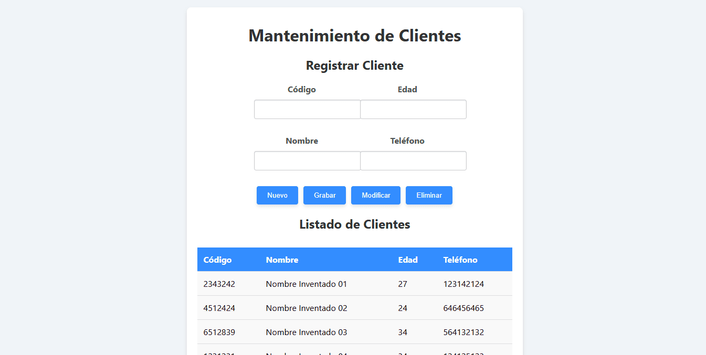

# Manejo de Clientes

Este código HTML, CSS, PHP y SQL encapsula una práctica de programación web centrada en la gestión de clientes. La interfaz de usuario ofrece una experiencia limpia y accesible, diseñada para dispositivos de diferentes tamaños gracias a su diseño responsivo.

<p align="center">
  
</p>

La página presenta dos secciones principales:

- **Registro de Clientes:** Aquí, los usuarios pueden ingresar los datos de un nuevo cliente, incluyendo código, edad, nombre y teléfono. Se proporcionan opciones para limpiar los campos, guardar la información, modificar registros existentes o eliminar clientes de la base de datos.

- **Listado de Clientes:** Muestra una tabla dinámica que recupera y exhibe los datos almacenados en la base de datos. Los registros son obtenidos mediante una consulta SQL ejecutada en el backend.

La funcionalidad está respaldada por un conjunto de scripts PHP, que se encargan de las operaciones de inserción, modificación y eliminación de datos en la base de datos. Además, se incluye un archivo de conexión (**conexion.php**) que establece la comunicación con la base de datos MySQL.

Este código, además de su funcionalidad práctica, exhibe prácticas recomendadas en el desarrollo web moderno, como el uso de estilos CSS para una presentación visual coherente y la separación de preocupaciones entre la estructura HTML y la lógica de backend en PHP.

**Consulta la versión preliminar de la practica aquí:** [https://practica_01.com](https://www.alejandrovillegas.dev/projects/practice-01/index.php)

# 📌 Información de la Practica

Esta practica ha sido desarrollado como parte del portafolio de soluciones tecnológicas, con el objetivo de ofrecer una herramienta eficiente y funcional para usuarios autodidactas interesados en la gestión y desarrollo de proyectos web.

- **Área**: Desarrollo de Practicas Web

- **Usuario Final**: TecNM

- **Fecha de Desarrollo**: 20 de enero de 2018

- **Portafolio de Proyectos**: [www.alejandrovillegas.dev](https://www.alejandrovillegas.dev)

# Guía de Instalación y Configuración

## 🖥️ Requisitos del Sistema

Para ejecutar esta practica de manera local, es necesario contar con un entorno de desarrollo que incluya Apache, MySQL y PHP. Se recomienda el uso de **XAMPP**, ya que fue el entorno con el que se desarrolló la practica. Sin embargo, también es compatible con:

- **XAMPP** (Windows, macOS, Linux)

- **WAMP** (Windows)

- **MAMP** (macOS, Windows)

- **LAMP** (Linux)

## 🔧 Instalación y Configuración de la Practica

Siga los pasos según el entorno de desarrollo que esté utilizando:

### Para XAMPP (Recomendado)

1. Descargue y descomprima el archivo de la practica en su sistema local.

2. Copie la carpeta de la practica y colóquela en el directorio **_htdocs_** dentro de la carpeta de instalación de XAMPP (Ejemplo: **C:\xampp\htdocs\mi_practica**).

### Para WAMP

1. Descargue y descomprima el archivo de la practica.

2. Copie la carpeta de la practica y colóquela en el directorio **_www_** dentro de la carpeta de instalación de WAMP (Ejemplo: **C:\wamp64\www\mi_practica**).

### Para MAMP

1. Descargue y descomprima el archivo de la practica.

2. Copie la carpeta de la practica y colóquela en el directorio **_htdocs_** dentro de la carpeta de instalación de MAMP (Ejemplo: **/Applications/MAMP/htdocs/mi_practica**).

### Para LAMP

1. Descargue y descomprima el archivo de la practica.

2. Mueva la carpeta de la practica a **_/var/www/html/_** utilizando el siguiente comando en la terminal:

```
sudo mv mi_practica /var/www/html/
```

## 🗄️ Configuración de la Base de Datos

### Para XAMPP, WAMP y MAMP

1. Inicie su entorno de desarrollo y asegúrese de que **Apache** y **MySQL** estén en ejecución.

2. Abra su navegador y acceda a **_phpMyAdmin_** ingresando:

- **XAMPP**: http://localhost/phpmyadmin

- **WAMP**: http://localhost/phpmyadmin

- **MAMP**: http://localhost:8888/phpmyadmin

3. Diríjase a la pestaña **SQL** e ingrese el siguiente código para crear la base de datos:

```
CREATE DATABASE General;
```

4. Vaya a la pestaña Importar y seleccione el archivo **_DataBase.sql_** del repositorio para importar la estructura y los datos.

### Para LAMP

1. Abra la terminal y acceda a MySQL con:

```
mysql -u root -p
```

2. Cree la base de datos ejecutando:

```
CREATE DATABASE General;
```

3. Salga de MySQL y luego importe la base de datos con:

```
mysql -u root -p General < /ruta/del/archivo/DataBase.sql
```

Reemplace **_/ruta/del/archivo/_** con la ubicación real del archivo en su sistema.

## 🚀 Ejecución de la Practica

1. Inicie su entorno de desarrollo:

- **XAMPP**: Abra el "Panel de Control de XAMPP" y active **Apache** y **MySQL**.

- **WAMP**: Haga clic en el icono de WAMP y active los servicios.

- **MAMP**: Abra MAMP y haga clic en **Start Servers**.

- **LAMP**: Ejecute los siguientes comandos en la terminal:

```
sudo systemctl start apache2
sudo systemctl start mysql
```

2. Abra un navegador e ingrese la siguiente URL según el entorno:

- **XAMPP / WAMP**: **_http://localhost/_**

- **MAMP**: **_http://localhost:8888/_**

- **LAMP**: **_http://localhost/_**

La practica ahora está funcionando en su entorno local. 🎉
